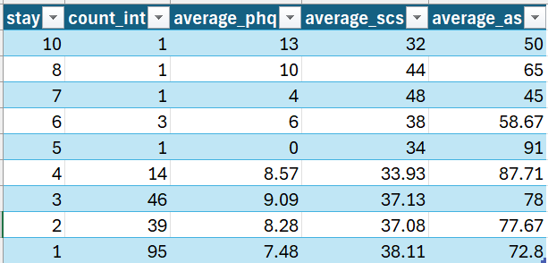
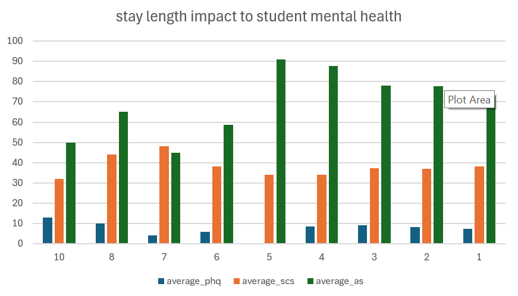

# Data Analytics Project

## Overview
Analyzing Students' Mental Health
Bu proyektdə xaricdə təhsil alan tələbələrin mental sağlıqlarının analizi və onlara təsir edən ən güclü amillər araşdırılmışdır.
SQL ilə sorğu aparılmış daha sonra result set csv olaraq export edilmişdir. Bu CSV faylını exceldə vizuallaşdırmışam.

average_phq - PHQ-9 (Patient Health Questionnaire-9) — depressiya əlamətlərini ölçmək üçün istifadə olunan qısa bir psixoloji testdir.
average_scs - SCS testi adətən Self-Compassion Scale (Özünə şəfqət / özünə mərhəmət testi) deməkdir.
average_as  -  ASISS = Academic / Social / Emotional / Self-Identity Screening Scale və ya bəzi ölkələrdə psixoloji və sosial uyğunlaşma skrininq testi kimi keçir.

## RESULT SET

## VISUAL

## Key Insights
Analiz və vizuallaşdırmanın nəticəsinə baxsaq görərik ki, 5 ilə qədər nəticələr artan tempdə davam edir. 5 ildən sonra isə stabilləşir.
Lakin result set viuzalına baxsaq görərik ki, 5 və daha yuxarı illərdə count_int yəni beynəlxalq tələbə sayı analiz barədə fikir bildirmək üçün çox azdır. (1-3 arası)
1-4 illlərə görə baxsaq depressiya əlamətləri və özünə şəfqət testlərində illər üzrə çox da fərq hiss olunmasa da psixoloji və sosial uyğunlaşmada yüksəlmə əlamətləri görsənir.

## Tools Used
-SQL
-EXCEL

